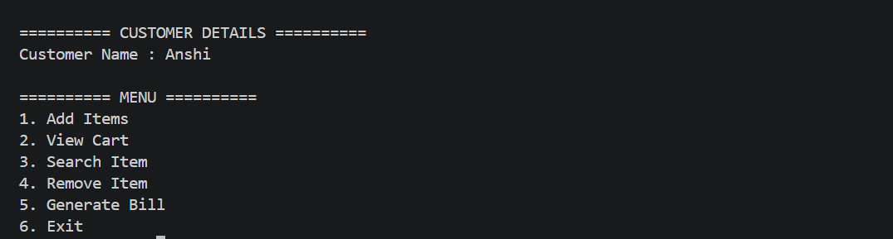
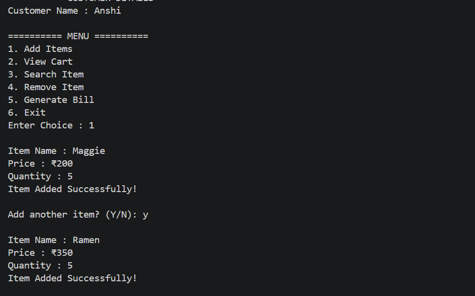
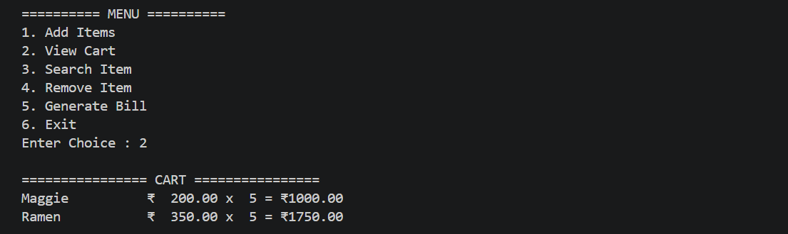
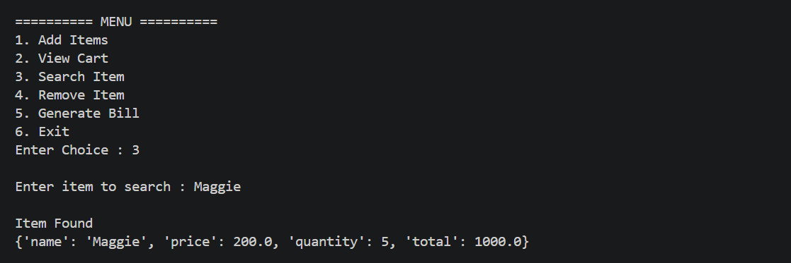
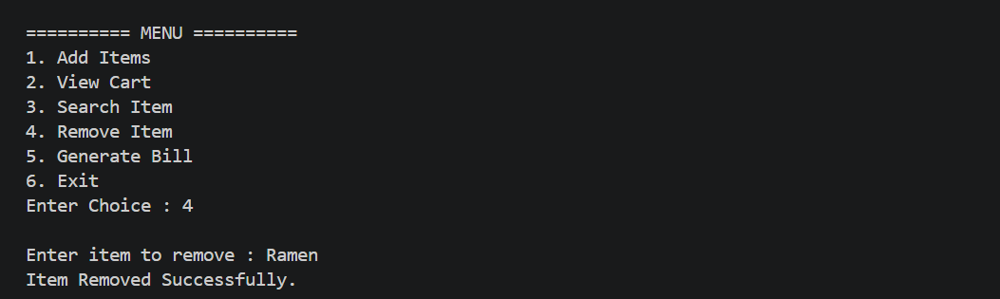
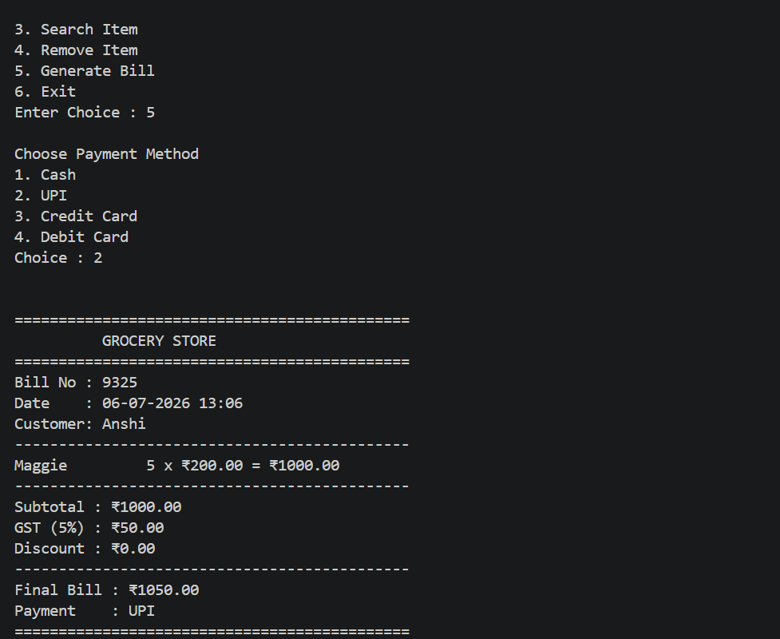
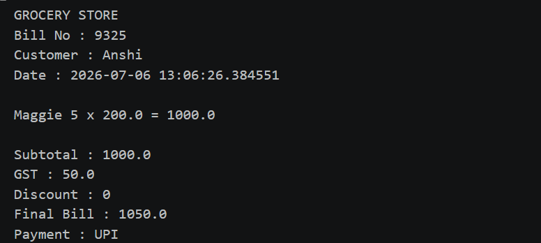

# 🛒 Grocery Bill Calculator
A simple Python project that simulates real-world grocery billing operations with receipt generation.

A beginner-friendly **console-based Grocery Billing System built using Python and Object-Oriented Programming (OOP)**.  
This project simulates a real-world billing system where users can add items, calculate total bills with GST and discounts, generate receipts, and save them as text files.

---

## ✨ Features

- 👤 Customer details input  
- 🛍️ Add multiple grocery items  
- 📋 View shopping cart  
- 🔍 Search an item  
- ❌ Remove an item from cart  
- 🧮 Automatic bill calculation  
- 💰 GST calculation (5%)  
- 🎉 Discount system (25% on bills ≥ ₹2000)  
- 💳 Payment methods:
  - Cash  
  - UPI  
  - Credit Card  
  - Debit Card  
- 🧾 Generate detailed receipt  
- 💾 Save receipt as `.txt` file  
- ⚠️ Input validation using exception handling  

---

## 🛠️ Tech Stack

- Python 3  
- Object-Oriented Programming (OOP)  
- File Handling  
- Exception Handling  
- Command Line Interface (CLI)  

---

## 📂 Project Structure
Grocery-Bill-Calculator/
│── grocery_bill_calculator.py
│── README.md
│── menu.png
│── add-items.png
│── cart.png
│── search-item.png
│── remove-item.png
│── receipt.png
│── saved-receipt.png

---

## 🚀 Getting Started

### Clone the Repository

```bash
git clone https://github.com/lakshmi1810-create/Grocery-Bill-Calculator.git
```

### Navigate to the Project

```bash
cd Grocery-Bill-Calculator
```

### Run the Program

```bash
python grocery_bill_calculator.py
```

---

## 📋 Menu

```text
========== MENU ==========

1. Add Items
2. View Cart
3. Search Item
4. Remove Item
5. Generate Bill
6. Exit
```

---

## 🧾 Billing Rules

| Feature              | Value        |
| -------------------- | ------------ |
| GST                  | 5%           |
| Discount             | 25%          |
| Discount Eligibility | Bill ≥ ₹2000 |

---

# 📸 Screenshots

## Main Menu



---

## Adding Items



---

## View Cart



---

## Search Item



---

## Remove Item



---

## Generated Receipt



---

## Saved Receipt (.txt File)



---

## 📚 Python Concepts Used

* Classes & Objects
* Constructors (`__init__`)
* Functions
* Lists & Dictionaries
* Loops
* Conditional Statements
* Exception Handling
* File Handling
* Date & Time Handling
* Random Number Generation

---

## 🔮 Future Enhancements

* GUI using Tkinter or PyQt
* SQLite/MySQL database integration
* Inventory management
* Customer purchase history
* PDF receipt generation
* Email receipt functionality
* Barcode scanner support
* Admin login system

---

## 🤝 Contributing

Contributions are welcome.

1. Fork this repository.
2. Create a feature branch.
3. Commit your changes.
4. Push to your branch.
5. Open a Pull Request.

---

## 📄 License

This project is licensed under the MIT License.

---

## 👨‍💻 Author

**Lakshmi Chauhan**

GitHub: https://github.com/lakshmi1810-create

---

⭐ If you like this project, don't forget to **Star** the repository!
